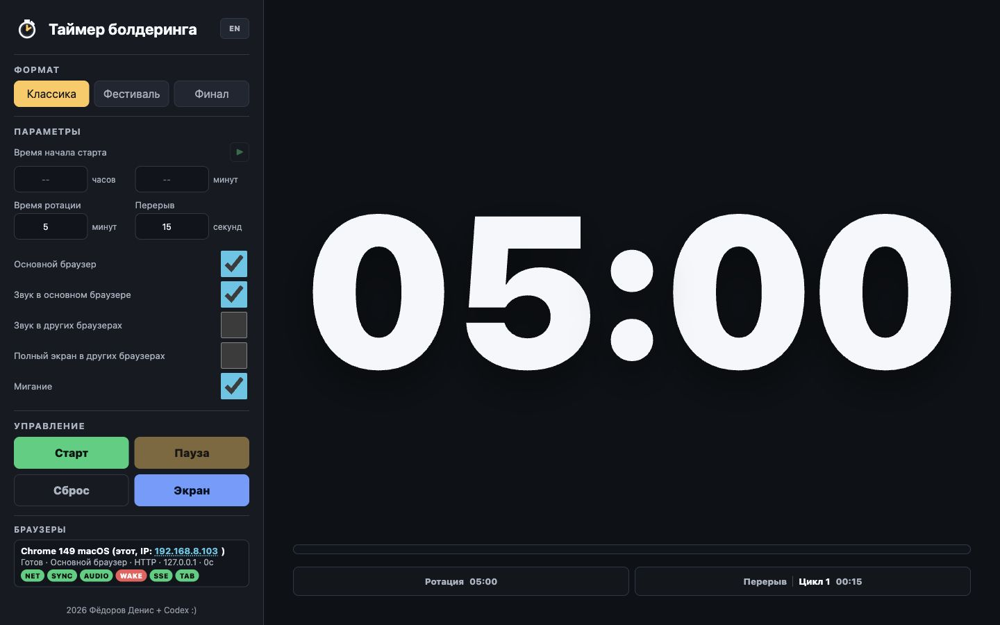

# FDV Bouldering Timer

**Русский** | [English](#english)

Сетевой таймер для проведения соревнований по болдерингу. Один компьютер управляет отсчётом, а телефоны, планшеты, телевизоры и другие компьютеры в локальной сети могут использоваться как синхронизированные экраны.



[Скачать последнюю версию](https://github.com/dfedorov-arch/fdv-bouldering-timer/releases/latest) · [Открыть сайт проекта](https://dfedorov-arch.github.io/fdv-bouldering-timer/) · [Полное руководство](https://dfedorov-arch.github.io/fdv-bouldering-timer/help.html)

## Возможности

- Форматы **Классика**, **Фестиваль** и **Финал**.
- Синхронизация нескольких экранов по локальной сети.
- Продолжение отсчёта на экране при временной потере соединения.
- Запуск сразу или по заданному времени.
- Управление подключёнными браузерами и диагностика связи.
- Настраиваемые звуковые профили, цвета и локальные шрифты.
- Интерфейс и руководство на русском и английском языках.
- Работа по HTTP или HTTPS.
- Portable-сборки для Windows, macOS и Linux со встроенным Node.js.

## Быстрый запуск

1. Откройте раздел [Releases](https://github.com/dfedorov-arch/fdv-bouldering-timer/releases/latest) и скачайте архив для своей системы и архитектуры.
2. Распакуйте архив целиком.
3. Запустите `start-timer.bat` в Windows, `start-timer-mac.command` в macOS или `start-timer-linux.sh` в Linux.
4. На компьютере сервера откройте `http://127.0.0.1:8008/`.
5. На остальных экранах откройте сетевой адрес, показанный при запуске, например `http://192.168.1.68:8008/`.

Все устройства должны находиться в одной локальной сети. В Windows разрешите Node.js доступ к частной сети. В macOS при первом запуске может потребоваться открыть файл через контекстное меню **Открыть**.

Подробная первоначальная настройка, перенос на другой компьютер, HTTPS и диагностика описаны в [краткой инструкции](ReadMe.txt) и [полном руководстве](help.html).

## Запуск из исходного кода

Требуется актуальная версия Node.js LTS:

```bash
node serve-bouldering-timer.js
```

Основные параметры находятся в `params.txt`. Порты по умолчанию: `8008` для HTTP и `8443` для HTTPS.

## Горячие клавиши

| Клавиши | Действие |
| --- | --- |
| `Z` / `Я` | Старт или продолжить |
| `Ctrl+Q` / `Ctrl+Й` | Пауза |
| `P` / `З` | Сброс |
| `Ctrl+F` / `Ctrl+А` | Полный экран |
| `Ctrl+M` / `Ctrl+Ь` | Назначить браузер основным |

Пробел не управляет таймером.

## Лицензия

Проект распространяется по лицензии [MIT](LICENSE).

---

<a id="english"></a>

## English

FDV Bouldering Timer is a networked competition timer. One computer controls the countdown while phones, tablets, TVs, and other computers on the local network act as synchronized displays.

[Download the latest release](https://github.com/dfedorov-arch/fdv-bouldering-timer/releases/latest) · [Project website](https://dfedorov-arch.github.io/fdv-bouldering-timer/) · [Full user guide](https://dfedorov-arch.github.io/fdv-bouldering-timer/help.html?lang=en)

### Features

- Classic, Festival, and Final competition formats.
- Multiple synchronized displays over a local network.
- Local countdown continuity during temporary connection loss.
- Immediate or scheduled starts.
- Connected-browser controls and connection diagnostics.
- Configurable sound profiles, colors, and bundled local fonts.
- Russian and English interface and documentation.
- HTTP and HTTPS support.
- Portable Windows, macOS, and Linux builds with bundled Node.js.

### Quick start

1. Open [Releases](https://github.com/dfedorov-arch/fdv-bouldering-timer/releases/latest) and download the archive for your operating system and architecture.
2. Extract the complete archive.
3. Run `start-timer.bat` on Windows, `start-timer-mac.command` on macOS, or `start-timer-linux.sh` on Linux.
4. Open `http://127.0.0.1:8008/` on the server computer.
5. Open the network address printed by the launcher on other displays, for example `http://192.168.1.68:8008/`.

All devices must be connected to the same local network. See the [quick-start guide](ReadMe.txt) and the [full user guide](help.html?lang=en) for setup, migration, HTTPS, and troubleshooting.

The project is available under the [MIT License](LICENSE).
